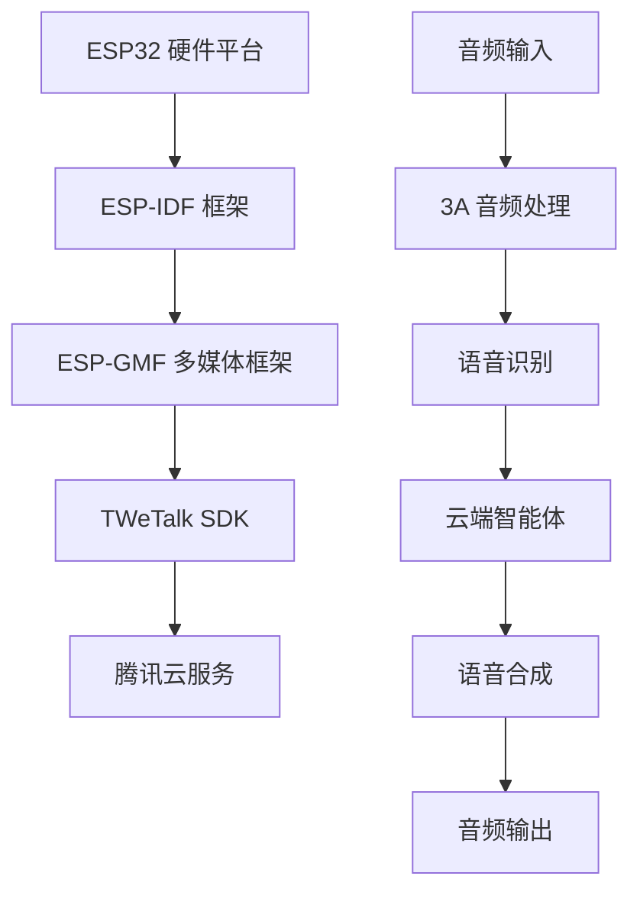

# 腾讯云 TWeTalk 智能语音设备接入

<div align="center">

[](https://docs.espressif.com/projects/esp-idf/en/latest/)
[](LICENSE)
[](https://www.espressif.com/zh-hans/products/socs)

*基于 ESP-GMF 框架的智能语音交互设备解决方案*

</div>

## 📚 目录

- [项目概述](#-项目概述)
- [技术特性](#-技术特性)
- [快速开始](#-快速开始)
- [环境准备](#-环境准备)
- [硬件适配](#-硬件适配)
- [功能配置](#-功能配置)
- [编译部署](#-编译部署)
- [使用指南](#-使用指南)
- [故障排查](#-故障排查)
- [技术支持](#-技术支持)

---

## 🎯 项目概述

本项目是基于 ESP32 系列芯片的腾讯云 TWeTalk 智能语音设备实现，为开发者提供完整的语音交互解决方案。通过集成腾讯云物联网开发平台的 TWeTalk SDK，实现与智能体的自然语音对话，并支持音乐点播、微信电话等丰富功能。

### 🌟 核心价值

- **🚀 开箱即用**：基于成熟的 ESP-GMF 多媒体框架，简化开发流程
- **🔧 灵活适配**：支持多种硬件平台和自定义开发板
- **🎵 功能丰富**：不仅是语音助手，还支持音乐娱乐和通信功能
- **⚡ 高性能**：集成专业的 3A 音频算法，确保优质交互体验

### 📋 前置阅读

> **⚠️ 重要提醒**：在开始项目开发前，请务必仔细阅读官方接入指引
> 
> 📖 [TWeTalk 设备接入指引](https://doc.weixin.qq.com/doc/w3_AJkAsAbTADsCNhIeEPMZsTXCETJk6?scode=AJEAIQdfAAot612P7vAJkAsAbTADs)

---

## ✨ 技术特性

### 🎤 智能语音交互

<table>
<tr>
<td width="50%">

**🗣️ 多种交互模式**
- 直接对话模式（连续交互）
- 语音唤醒模式（"Hi 乐鑫"）
- 物理按键触发模式

</td>
<td width="50%">

**🔊 专业音频处理**
- 3A 算法集成（AEC/AGC/ANR）
- 多种编码格式支持
- 自适应音量调节

</td>
</tr>
<tr>
<td>

**🌐 云端智能服务**
- 腾讯云 TWeTalk SDK
- 实时语音识别与合成
- 智能体对话能力

</td>
<td>

**📱 扩展功能支持**
- 🎵 音乐点播服务
- 📞 微信电话功能
- 💬 自然语言理解

</td>
</tr>
</table>

### 🏗️ 技术架构



**核心技术栈**
- **硬件平台**：ESP32/ESP32-S3/ESP32-P4 等
- **开发框架**：ESP-IDF v5.4+
- **多媒体框架**：[ESP-GMF](https://github.com/espressif/esp-gmf)
- **云服务接入**：腾讯云 TWeTalk SDK
- **协议支持**：WebSocket、MQTT

---

## 🚀 快速开始

### ⚡ 一键体验（推荐硬件）

如果您使用 **立创·实战派 ESP32-S3 开发板**，可以快速开始：

```bash
# 1. 克隆项目
git clone [项目地址]
cd tc-iot-twetalk-esp-gmf-v2

# 2. 配置环境
./install.sh && source ./export.sh

# 3. 设置目标芯片
idf.py set-target esp32s3

# 4. 配置项目
idf.py menuconfig
# 配置 WiFi 信息和腾讯云设备信息

# 5. 编译烧录
idf.py build flash monitor
```

### 📋 基本配置清单

在 `menuconfig` 中完成以下配置：

#### 🌐 网络配置
- **路径**：`Example Connection Configuration`
- **配置项**：WiFi SSID 和密码

#### 🔐 设备认证配置
- **路径**：`Example Audio Configuration`
- **必填项**：
  - `QCLOUD_PRODUCT_ID`：腾讯云产品 ID
  - `QCLOUD_DEVICE_NAME`：设备名称
  - `QCLOUD_DEVICE_SECRET`：设备密钥
  - `TWETALK_CALLING_NAME`：呼叫名称
  - `TWETALK_CALLING_OPENID`：微信 OpenID

> 💡 **获取方式**：这些信息可从腾讯云物联网开发平台获取，详见接入指引文档

---

## 🛠️ 环境准备

### 💻 开发环境要求

| 组件 | 版本要求 | 说明 |
|------|---------|------|
| ESP-IDF | v5.4+ | 主开发框架 |
| Python | 3.8+ | 构建工具依赖 |
| CMake | 3.16+ | 构建系统 |
| Git | 2.0+ | 版本控制 |

### ⚙️ 环境配置步骤

#### 1. 安装 ESP-IDF

```bash
# 下载 ESP-IDF
git clone --recursive https://github.com/espressif/esp-idf.git
cd esp-idf

# 安装依赖
./install.sh

# 设置环境变量
source ./export.sh
```

#### 2. 验证安装

```bash
# 检查工具链版本
xtensa-esp32-elf-gcc --version

# 验证 IDF 版本
idf.py --version
```

> 📚 **详细指南**：[ESP-IDF 编程指南](https://docs.espressif.com/projects/esp-idf/zh_CN/latest/esp32s3/get-started/index.html)

### 🔧 项目依赖

项目依赖的组件将在首次编译时自动下载：

- **ESP-GMF**：多媒体框架核心
- **codec_board**：音频编解码板驱动
- **qcloud_iot_c_sdk**：腾讯云物联网 SDK

---

## 🏷️ 硬件适配

### 🎯 推荐开发板

#### 默认支持平台

<table>
<tr>
<td align="center" width="50%">

<br>
<strong>立创·实战派 ESP32-S3</strong>
<br>
<a href="https://lckfb.com/project/detail/lckfb-esp32-s3-va?param=baseInfo&collection=71ac02fcf595444eb5dbbc45ae4ffda8">🔗 查看详情</a>
</td>
<td align="center" width="50%">

<br>
<strong>其他支持平台</strong>
<br>
在 menuconfig 中选择
</td>
</tr>
</table>

#### 🔍 选择路径
`menuconfig → GMF APP Configuration → Target Board`


### 💡 高级技巧

**推荐做法**：将 `tempotian__codec_board` 和 `espressif__gmf_app_utils` 复制到 `components` 目录下进行自定义修改，避免版本更新时丢失配置。

```bash
cp -r managed_components/tempotian__codec_board components/
cp -r managed_components/espressif__gmf_app_utils components/
```

---

## ⚙️ 功能配置

### 🎵 音频编解码配置

#### 支持的音频格式

<div align="center">

| 格式 | 状态 | 采样率 | 比特率 | 应用场景 |
|------|------|--------|--------|----------|
| **OPUS** | ⭐ 推荐 | 16kHz | 24kbps | TWeTalk 标准格式 |
| **G.711A** | ✅ 支持 | 8kHz | 64kbps | 电话语音质量 |
| **G.711U** | ✅ 支持 | 8kHz | 64kbps | 电话语音质量 |  
| **PCM** | ✅ 支持 | 16kHz | 256kbps | 原始音频数据 |
| **AAC** | ✅ 支持 | 16kHz | 64kbps | 高质量音频 |

</div>

#### 🎯 TWeTalk 云服务规格要求

<table>
<tr>
<td width="50%">

**📊 音频参数**
- **编码格式**：OPUS
- **采样频率**：16 kHz
- **声道配置**：单声道（Mono）
- **目标码率**：24 kbps

</td>
<td width="50%">

**📦 数据格式**
- **帧长**：60ms
- **帧大小**：180 字节
- **传输协议**：WebSocket
- **数据封装**：Protocol Buffers

</td>
</tr>
</table>

### 🎮 工作模式配置

系统支持三种灵活的交互模式，可根据具体使用场景进行选择：

#### 🔄 1. 连续对话模式（Continuous Mode）

<details>
<summary><strong>点击展开详细信息</strong></summary>

**特点描述**：
- ✅ 无需唤醒词，支持持续语音交互
- ✅ 响应速度快，交互体验流畅
- ⚠️ 功耗相对较高

**适用场景**：
- 🏠 私人环境（家庭、个人办公室）
- 💬 需要频繁交互的应用
- 🎯 对延迟要求极低的场景

**激活方式**：
```
直接开始对话，系统自动检测语音活动
```

</details>

#### 🎤 2. 语音唤醒模式（Wake Word Mode）

<details>
<summary><strong>点击展开详细信息</strong></summary>

**特点描述**：
- 🛡️ 通过特定唤醒词激活，避免误触发
- 🔋 低功耗，待机时功耗极低
- 🎯 精准控制，减少干扰

**配置方式**：
```
menuconfig → ESP Speech Recognition → use wakenet → Select wake words
```

**默认唤醒词**：`"Hi 乐鑫"`

**适用场景**：
- 🏢 公共环境或多人环境
- 🔇 需要避免环境噪声误触发
- 💡 智能家居等 IoT 设备

**使用方法**：
```
说出唤醒词 → 听到提示音 → 开始对话
```

</details>

#### 🔘 3. 按键触发模式（Key Press Mode）

<details>
<summary><strong>点击展开详细信息</strong></summary>

**特点描述**：
- 🎯 物理按键控制，100% 避免误触发
- ⚡ 即时响应，按下即可开始
- 🔧 硬件控制，可靠性高

**默认按键**：`REC` 按键

**适用场景**：
- 🎧 专业录音或会议场景
- 🔒 对隐私要求极高的环境
- 🎮 需要精确控制时机的应用

**操作方式**：
```
按下 REC 键 → 开始录音 → 松开结束 → 处理响应
```

</details>

#### ⚙️ 模式配置

**默认配置**：系统默认启用 **语音唤醒模式**

**切换方法**：在 `menuconfig` 中的相应选项进行配置，或在代码中修改工作模式参数。

### 📱 芯片兼容性矩阵

<div align="center">

| 芯片型号 | 唤醒词模式 | 连续对话 | 按键模式 | AI 加速 | 建议场景 |
|---------|:----------:|:--------:|:--------:|:-------:|----------|
| **ESP32-S3** | ✅ | ✅ | ✅ | ✅ | 🌟 推荐全功能平台 |
| **ESP32-P4** | ✅ | ✅ | ✅ | ✅ | 🚀 高性能应用 |
| **ESP32** | ✅ | ✅ | ✅ | ➖ | 📦 经济型方案 |
| **ESP32-C3** | ❌ | ❌ | ✅ | ➖ | 🔘 简单按键控制 |
| **ESP32-C6** | ❌ | ❌ | ✅ | ➖ | 🔘 低功耗按键 |
| **ESP32-S2** | ❌ | ❌ | ✅ | ➖ | 🔘 基础功能 |

</div>

**图例说明：**
- ✅ 完全支持
- ❌ 不支持  
- ➖ 不适用
- 🌟 最佳选择
- 🚀 高端方案
- 📦 性价比选择
- 🔘 基础版本

> **📝 备注**：ESP32-C5 的连续模式支持正在开发中，预计在后续版本中提供。

---

## 🔨 编译部署

### 📋 编译前检查清单

在开始编译前，请确认以下环境已正确配置：

- [ ] ESP-IDF 环境已安装并激活
- [ ] 目标芯片已正确设置
- [ ] WiFi 网络信息已配置
- [ ] 腾讯云设备三元组已配置
- [ ] 硬件连接正确

### 🚀 标准编译流程

#### Step 1: 环境激活

```bash
# 进入 ESP-IDF 目录
cd /path/to/esp-idf

# 激活 ESP-IDF 环境
source ./export.sh

# 验证环境
echo $IDF_PATH
```

#### Step 2: 项目配置

```bash
# 进入项目目录
cd /path/to/tc-iot-twetalk-esp-gmf-v2

# 设置目标芯片（以 ESP32-S3 为例）
idf.py set-target esp32s3

# 使用esp32s3 default配置
cp sdkconfig.defaults.esp32s3 sdkconfig

```

#### Step 3: 参数配置

```bash
# 打开配置菜单
idf.py menuconfig
```

**重要配置项：**

<details>
<summary><strong>🌐 网络配置 (Example Connection Configuration)</strong></summary>

```
WiFi SSID: [您的WiFi名称]
WiFi Password: [您的WiFi密码]
```

</details>

<details>
<summary><strong>🔐 设备认证 (Example Audio Configuration)</strong></summary>

```
Product ID: [腾讯云产品ID]
Device Name: [设备名称]
Device Secret: [设备密钥]
Calling Name: [微信呼叫名称]
Calling OpenID: [微信OpenID]
```

</details>

<details>
<summary><strong>🎵 音频配置 (Audio Configuration)</strong></summary>

```
Audio Format: OPUS (推荐)
Sample Rate: 16000 Hz
Channels: 1 (Mono)
Bit Rate: 24 kbps
```

</details>

#### Step 4: 编译项目

```bash
# 清理之前的构建（可选）
idf.py clean

# 开始编译
idf.py build
```

**编译输出示例：**
```
Project build complete. To flash, run:
  idf.py flash
or
  idf.py -p (PORT) flash
```

#### Step 5: 烧录和监控

```bash
# 自动检测端口并烧录
idf.py flash

# 或指定端口烧录并开始监控
idf.py -p /dev/ttyUSB0 flash monitor

# 仅启动监控（不烧录）
idf.py monitor
```

### 🔧 高级编译选项

#### 并行编译（加速构建）

```bash
# 使用多线程编译
idf.py -j8 build

# 或设置环境变量
export IDF_PARALLEL_BUILD=8
idf.py build
```

#### 部分编译

```bash
# 仅编译主应用
idf.py app

# 仅编译引导加载程序  
idf.py bootloader

# 重新生成分区表
idf.py partition_table
```

#### 调试模式编译

```bash
# Debug 模式编译
idf.py -D CMAKE_BUILD_TYPE=Debug build

# Release 模式编译
idf.py -D CMAKE_BUILD_TYPE=Release build
```

### 📊 烧录监控输出

**成功启动日志示例：**
```
INF|2690|mqtt_client.c|_qcloud_iot_mqtt_client_init(217): SDK_Ver: 4.1.0-fadbc92b544b4921dbb6d8951f99fb5cccfa3eaf, Product_ID: 7EJ1UNEKC9, Device_Name: xph001
I (3706) ESP_GMF_AENC: Open, type:OPUS, acquire in frame: 1920, out frame: 280
I (3707) ESP_GMF_TASK: One times job is complete, del[wk:0x3c3c8fa4, ctx:0x3c36c684, label:aud_enc_open]
INF|4206|network_interface.c|_network_tcp_connect(63): connected with TCP server: 7EJ1UNEKC9.iotcloud.tencentdevices.com:1883
INF|4288|mqtt_client.c|IOT_MQTT_Construct(325): mqtt connect with id: 3Reh3 success
INF|4289|twetalk_app.c|twetalk_thread_entry(380): Cloud Device Construct Success
```

---

## 📱 使用指南

### 🎯 快速验证

项目成功运行后，您将在串口监控中看到类似的启动日志：

```log
INF|2690|mqtt_client.c|_qcloud_iot_mqtt_client_init(217): SDK_Ver: 4.1.0-fadbc92b544b4921dbb6d8951f99fb5cccfa3eaf, Product_ID: 7EJ1UNEKC9, Device_Name: xph001
I (3706) ESP_GMF_AENC: Open, type:OPUS, acquire in frame: 1920, out frame: 280
I (3707) ESP_GMF_TASK: One times job is complete, del[wk:0x3c3c8fa4, ctx:0x3c36c684, label:aud_enc_open]
INF|4206|network_interface.c|_network_tcp_connect(63): connected with TCP server: 7EJ1UNEKC9.iotcloud.tencentdevices.com:1883
INF|4288|mqtt_client.c|IOT_MQTT_Construct(325): mqtt connect with id: 3Reh3 success
INF|4289|twetalk_app.c|twetalk_thread_entry(380): Cloud Device Construct Success
DBG|4294|mqtt_client_subscribe.c|qcloud_iot_mqtt_subscribe(350): subscribe topic_name=$thing/down/property/7EJ1UNEKC9/xph001|packet_id=59484
INF|4448|twetalk_app.c|_mqtt_event_handler(212): subscribe success, packet-id=59484
DBG|4511|mqtt_client_subscribe.c|qcloud_iot_mqtt_subscribe(350): subscribe topic_name=$thing/down/action/7EJ1UNEKC9/xph001|packet_id=59485
INF|4653|twetalk_app.c|_mqtt_event_handler(212): subscribe success, packet-id=59485
DBG|4717|mqtt_client_subscribe.c|qcloud_iot_mqtt_subscribe(350): subscribe topic_name=$twecall/down/service/7EJ1UNEKC9/xph001|packet_id=59486
INF|4774|twetalk_app.c|_mqtt_event_handler(212): subscribe success, packet-id=59486
DBG|4922|mqtt_client_publish.c|qcloud_iot_mqtt_publish(264): publish qos=1|packet_id=59487|topic_name=$twecall/up/service/7EJ1UNEKC9/xph001|payload={"method":"query_websocket_url","clientToken":"ws-4","params":{}}
DBG|4932|twetalk_mqtt.c|IOT_TWeCall_QueryWSURL(196): wait query_websocket_url reply....
INF|4987|twetalk_app.c|_mqtt_event_handler(236): publish success, packet-id=59487
DBG|5209|twetalk_mqtt.c|_twecall_message_cb(55): twecall message arrived: {"method":"query_websocket_url_reply","clientToken":"ws-4","code":0,"status":"","params":{"token":"8bfef20b739211f0a8b252540077cf75","websocket_url":"ws://iot-twetalk.tencentiotcloud.com/ws","websocket_port":80}}

INF|5341|twetalk.c|tc_twetalk_ws_init(265): ws url is ws://stress-test.tencentiotcloud.com/ws?role_id=QQ_hard 80
DBG|5342|twetalk_ws.c|_ws_request(259): ws url:ws://stress-test.tencentiotcloud.com/ws?role_id=QQ_hard, port:80
INF|5511|network_interface.c|_network_tcp_connect(63): connected with TCP server: stress-test.tencentiotcloud.com:80
INF|5971|twetalk.c|_ws_recv_thread_entry(92): ws recv thread start
INF|5976|twetalk.c|tc_twetalk_ws_init(351): ai talk init success(0)
DBG|5977|data_template_config.c|iot_data_template_property_value_set(219): set property battery :0 >>> 100
INF|5984|twetalk_call.c|tc_twetalk_call_event_type_print(128): 👤 [03] USR_TRANSCRIPTION - 用户字幕
INF|5994|twetalk_app.c|_twetalk_recv_event_cb(314): usr: this is TranscriptionFrame
DBG|6004|mqtt_client_publish.c|qcloud_iot_mqtt_publish(264): publish qos=0|packet_id=0|topic_name=$thing/up/property/7EJ1UNEKC9/xph001|payload={"method":"report","params":{"battery":100,"volume":0},"clientToken":"clear-control-6"}
DBG|6024|data_template_config.c|iot_data_template_property_value_set(219): set property volume :0 >>> 80
DBG|6034|mqtt_client_publish.c|qcloud_iot_mqtt_publish(264): publish qos=0|packet_id=0|topic_name=$thing/up/property/7EJ1UNEKC9/xph001|payload={"method":"report","params":{"volume":80},"clientToken":"clear-control-6"}
DBG|6133|data_template_property.c|data_template_property_message_handler(211): receive property message:{"method":"report_reply","clientToken":"clear-control-6","code":0,"status":"success"}
DBG|6205|data_template_property.c|data_template_property_message_handler(211): receive property message:{"method":"report_reply","clientToken":"clear-control-6","code":0,"status":"success"}
W (7160) ESP_GMF_ASMP_DEC: Not enough memory for out, need:1920, old: 1024, new: 1920
I (7163) ESP_GMF_TASK: One times job is complete, del[wk:0x3c30df28, ctx:0x3c3c91ec, label:aud_bit_cvt_open]
I (7167) ESP_GMF_TASK: One times job is complete, del[wk:0x3c3fd8cc, ctx:0x3c30db08, label:aud_rate_cvt_open]
INF|6239|twetalk_call.c|tc_twetalk_call_event_type_print(119): 🎤 [00] BOT_START_SPEAKING - 机器人开始说话
I (7176) ESP_GMF_TASK: One times job is complete, del[wk:0x3c3f55ec, ctx:0x3c30dc5c, label:aud_ch_cvt_open]
INF|6265|twetalk_app.c|_twetalk_recv_event_cb(298): bot start speaking
INF|6862|twetalk_call.c|tc_twetalk_call_event_type_print(125): 🤖 [02] BOT_TRANSCRIPTION - 机器人字幕
INF|6862|twetalk_app.c|_twetalk_recv_event_cb(308): bot: this is LLMTextFrame\u4f60\u597d\u5440\uff0c\u6211\u662fQQ\u9e45\u4ed4\uff0c\u662f\u4e00\u4e2a\u966a\u4f34\u4f60\u7684AI\u73a9\u5076\u3002
INF|7156|twetalk_call.c|tc_twetalk_call_event_type_print(125): 🤖 [02] BOT_TRANSCRIPTION - 机器人字幕
INF|7156|twetalk_app.c|_twetalk_recv_event_cb(308): bot: \u6211\u53ef\u4ee5\u7528\u6e29\u67d4\u4f53\u8d34\u3001\u98ce\u8da3\u5e7d\u9ed8\u7684\u65b9\u5f0f\u548c\u4f60\u804a\u5929\uff0c\u4e5f\u4f1a\u5c3d\u529b\u5e2e\u52a9\u4f60\u89e3\u51b3\u95ee\u9898\u3002
INF|7500|twetalk_call.c|tc_twetalk_call_event_type_print(125): 🤖 [02] BOT_TRANSCRIPTION - 机器人字幕
INF|7500|twetalk_app.c|_twetalk_recv_event_cb(308): bot: \u4f60\u53ef\u4ee5\u548c\u6211\u5206\u4eab\u4f60\u7684\u60f3\u6cd5\u3001\u5fc3\u60c5\uff0c\u6216\u8005\u8ba9\u6211\u5e2e\u4f60\u505a\u4e9b\u4e8b\u60c5\uff0c\u6bd4\u5982\u64ad\u653e\u97f3\u4e50\u3001\u67e5\u8be2\u5929\u6c14\u7b49\u7b49\u3002
INF|7603|twetalk_call.c|tc_twetalk_call_event_type_print(125): 🤖 [02] BOT_TRANSCRIPTION - 机器人字幕
INF|7603|twetalk_app.c|_twetalk_recv_event_cb(308): bot: \u5e0c\u671b\u6211\u4eec\u53ef\u4ee5\u6210\u4e3a\u597d\u670b\u53cb\uff01
INF|25882|twetalk_ws.c|ws_recv(474): Received Ping, auto-replied Pong (payload len:1010821420 data len : 4)
INF|44083|twetalk_call.c|tc_twetalk_call_event_type_print(122): 🔇 [01] BOT_STOP_SPEAKING - 机器人停止说话
INF|44083|twetalk_app.c|_twetalk_recv_event_cb(303): bot stop speaking
INF|46032|twetalk_ws.c|ws_recv(474): Received Ping, auto-replied Pong (payload len:1010821420 data len : 4)
```

### 🎮 基本使用流程

#### 🚀 设备启动阶段

1. **硬件检查**
   - 确保开发板正确连接电源
   - 验证音频设备（麦克风、扬声器）工作正常
   - 检查网络连接状态

2. **软件初始化**  
   - 观察串口日志，确认各模块正常启动
   - 等待 WiFi 连接成功提示
   - 等待 TWeTalk 服务连接确认

#### 🎤 语音交互阶段

<table>
<tr>
<td width="33%">

**🔄 连续对话模式**
```
1. 设备启动完成
2. 直接开始说话
3. 系统自动识别语音
4. 等待智能体回复
5. 继续对话...
```

</td>
<td width="33%">

**🎤 唤醒词模式**
```
1. 说出唤醒词 "Hi 乐鑫"
2. 听到提示音 "叮咚"
3. 开始说话交互
4. 等待回复播放完成
5. 需要再次唤醒继续
```

</td>
<td width="33%">

**🔘 按键模式**  
```
1. 按住 REC 按键
2. 开始说话
3. 松开按键结束录音
4. 系统处理并回复
5. 重复按键继续交互
```

</td>
</tr>
</table>

#### 🎵 功能体验建议

**基础对话测试：**
```
"你好" / "今天天气怎么样" / "讲个笑话"
```

**音乐功能测试：**
```  
"播放音乐" / "播放周杰伦的歌" / "暂停音乐"
```

**微信电话测试：**
```
"打电话给XXX" / "拨打微信电话"
```

### 📊 状态指示说明

#### 串口日志级别

```log
E (xxxx) TAG: 错误信息 - 需要立即处理的问题
W (xxxx) TAG: 警告信息 - 可能影响功能的问题  
I (xxxx) TAG: 信息提示 - 正常的状态更新
D (xxxx) TAG: 调试信息 - 开发调试使用
V (xxxx) TAG: 详细信息 - 最详细的日志级别
```

### 🎯 性能优化建议

#### 🌐 网络环境优化

- **WiFi 信号强度**：保持 -50dBm 以上的信号强度
- **网络延迟**：建议延迟 < 100ms 以获得最佳体验  
- **带宽要求**：上行至少 64kbps，下行至少 128kbps

#### 🔊 音频环境优化

- **环境噪声**：控制环境噪声 < 40dB，提升识别准确率
- **设备距离**：建议说话距离为 0.5-2 米
- **音量设置**：根据环境调整合适的播放音量

---

## 🔍 故障排查

### 🚨 常见问题解决方案

#### ❌ 问题 1: 设备自问自答现象

<details>
<summary><strong>🔍 点击查看详细解决方案</strong></summary>

**🎯 问题描述：**
设备出现自问自答，即播放的音频被麦克风重新采集并识别，导致系统误触发持续对话。

**🔍 根本原因分析：**
- 不同硬件平台的麦克风和扬声器频响特性存在差异
- 麦克风与扬声器物理距离过近，声学隔离不足
- 音频增益参数设置不当，影响 AEC（回声消除）算法效果
- 环境反射音过强，增加了回声消除的难度

**🛠️ 解决方案：**

**方案一：音频参数调整**
```c
// 在 main/audio_processor.c 中调整以下参数：
#define DEFAULT_RECORD_DB        6    // 录音增益 (建议范围: 12 ~ 0)
#define DEFAULT_RECORD_REF_DB    26   // 参考信号增益 (建议范围: 30 ~ 20)  
#define DEFAULT_PLAYBACK_VOLUME  60    // 播放音量 (建议范围: 40 ~ 80)
```

**方案二：启用 AEC 调试模式**
```bash
# 1. 在 menuconfig 中启用调试
menuconfig → Example Audio Configuration → Enable AEC Debug

# 2. 插入 SD 卡（用于保存录音数据）
# 3. 重新编译烧录
idf.py build flash

# 4. 录音文件将保存到 /sdcard/debug/ 目录
# 5. 分析录音数据，进一步调整参数
```

**方案三：硬件布局优化**
- 增加麦克风与扬声器的物理距离（建议 > 10cm）
- 在麦克风和扬声器之间添加物理隔板
- 使用定向麦克风，减少对扬声器方向的拾音

**⚠️ 注意事项：**
- AEC Debug 功能需要硬件支持 SD 卡
- 参数调整需要逐步测试，一次调整一个参数
- 不同硬件平台可能需要不同的参数组合

</details>

#### 🔊 问题 2: 音频播放卡顿

<details>
<summary><strong>🔍 点击查看详细解决方案</strong></summary>

**🎯 问题描述：**
扬声器播放智能体回复时出现明显的卡顿、断续或延迟现象。

**🔍 根本原因分析：**
- 网络连接不稳定，数据包传输出现丢包或延迟
- 音频缓冲区配置过小，无法有效缓解网络抖动
- ESP32 系统资源不足，CPU 或内存使用率过高
- 音频解码处理能力不足，无法实时处理音频流

**🛠️ 解决方案：**

**网络层面优化：**
```bash
# 1. 检查网络连接质量
ping -c 10 8.8.8.8

# 2. 测试 WiFi 信号强度
iw wlan0 station dump  # Linux 系统
# 或在 ESP32 日志中查看 RSSI 值

# 3. 更换网络环境测试
# 使用手机热点或其他网络进行对比测试
```


**调试方法：**
```c
// 在代码中添加性能监控
void monitor_system_performance() {
    size_t free_heap = esp_get_free_heap_size();
    size_t min_free = esp_get_minimum_free_heap_size();
    
    ESP_LOGI("PERF", "Free heap: %d, Min free: %d", free_heap, min_free);
    
    // CPU 使用率监控（需要启用 FreeRTOS stats）
    TaskStatus_t *pxTaskStatusArray;
    volatile UBaseType_t uxArraySize = uxTaskGetNumberOfTasks();
    // ... 任务状态分析
}
```

</details>

#### 🔌 问题 3: I2C 总线共享冲突

<details>
<summary><strong>🔍 点击查看详细解决方案</strong></summary>

**🎯 问题描述：**
当项目中有其他模块（如 LCD 显示屏、触摸屏、传感器等）也使用 I2C 总线时，出现设备初始化失败、通信异常或系统崩溃。

**🔍 根本原因分析：**
- audio_processor 模块默认会初始化并独占 I2C 总线
- 多个模块同时初始化 I2C 总线，造成资源竞争
- I2C 总线句柄管理不当，出现重复初始化或释放
- 不同模块的 I2C 配置参数冲突（时钟频率、上拉电阻等）

**🛠️ 解决方案：**

**情况一：audio_processor 初始化前已有 I2C**
```c
// 假设其他模块已经初始化了 I2C 总线
i2c_master_bus_handle_t existing_i2c_handle = get_existing_i2c_handle();

// 在初始化 audio_processor 时传入现有句柄
codec_info_t codec_info = {
    .i2c_handle = existing_i2c_handle,  // 使用现有的 I2C 句柄
    // 其他配置项...
};

esp_gmf_app_init(&codec_info);
```

**情况二：audio_processor 初始化后需要 I2C**
```c
// audio_processor 初始化完成后
esp_gmf_app_init(NULL);  // 使用默认配置

// 获取 audio_processor 创建的 I2C 句柄
i2c_master_bus_handle_t i2c_handle = esp_gmf_app_get_i2c_handle();

// 其他模块使用这个句柄
esp_err_t ret = i2c_master_probe(i2c_handle, device_address, 1000);
```

**最佳实践 - 集中式 I2C 管理：**
```c
// 创建一个 I2C 管理模块
typedef struct {
    i2c_master_bus_handle_t handle;
    bool is_initialized;
    int ref_count;
} i2c_manager_t;

static i2c_manager_t g_i2c_manager = {0};

// 获取 I2C 句柄
i2c_master_bus_handle_t i2c_manager_get_handle() {
    if (!g_i2c_manager.is_initialized) {
        // 初始化 I2C 总线
        i2c_master_bus_config_t i2c_bus_config = {
            .clk_source = I2C_CLK_SRC_DEFAULT,
            .i2c_port = I2C_NUM_0,
            .scl_io_num = GPIO_NUM_6,
            .sda_io_num = GPIO_NUM_5,
            .glitch_ignore_cnt = 7,
        };
        
        ESP_ERROR_CHECK(i2c_new_master_bus(&i2c_bus_config, &g_i2c_manager.handle));
        g_i2c_manager.is_initialized = true;
    }
    
    g_i2c_manager.ref_count++;
    return g_i2c_manager.handle;
}
```

**调试技巧：**
```c
// 添加 I2C 总线扫描功能
void i2c_bus_scan(i2c_master_bus_handle_t bus_handle) {
    ESP_LOGI("I2C", "Scanning I2C bus...");
    
    for (uint8_t addr = 1; addr < 127; addr++) {
        esp_err_t ret = i2c_master_probe(bus_handle, addr, 1000);
        if (ret == ESP_OK) {
            ESP_LOGI("I2C", "Found device at address: 0x%02X", addr);
        }
    }
}
```

</details>

### 🔧 调试工具和技巧

#### 📊 系统状态监控

```c
// 添加到您的主循环中
void print_system_status() {
    // 内存使用情况
    ESP_LOGI("SYS", "Free heap: %d bytes", esp_get_free_heap_size());
    ESP_LOGI("SYS", "Min free heap: %d bytes", esp_get_minimum_free_heap_size());
    
    // WiFi 连接状态
    wifi_ap_record_t ap_info;
    if (esp_wifi_sta_get_ap_info(&ap_info) == ESP_OK) {
        ESP_LOGI("WIFI", "RSSI: %d dBm", ap_info.rssi);
    }
}
```

---

## 📞 技术支持

### 🆘 获取帮助的最佳路径

遇到问题时，请按照以下优先级寻求解决方案：

#### 1️⃣ **自助解决（推荐优先）**

📖 **文档资源：**
- [本 README 完整指南](#)
- [TWeTalk 官方接入文档](https://doc.weixin.qq.com/doc/w3_AJkAsAbTADsCNhIeEPMZsTXCETJk6?scode=AJEAIQdfAAot612P7vAJkAsAbTADs)
- [ESP-IDF 编程指南](https://docs.espressif.com/projects/esp-idf/zh_CN/latest/)
- [ESP-GMF 框架文档](https://github.com/espressif/esp-gmf)

🔍 **问题排查清单：**
- [ ] 检查硬件连接是否正确
- [ ] 验证软件配置参数
- [ ] 查看串口日志错误信息  
- [ ] 对比本文档的故障排查章节
- [ ] 尝试重新编译和烧录

#### 2️⃣ **社区资源**

💬 **技术论坛：**
- [ESP32 中文社区](https://www.esp32.com/viewforum.php?f=26)
- [腾讯云 IoT 开发者社区](https://cloud.tencent.com/developer/column)
- [GitHub Issues](https://github.com/espressif/esp-idf/issues)

#### 3️⃣ **专业支持**

📞 **官方支持渠道：**
- **乐鑫技术支持**：[技术支持平台](https://www.espressif.com/zh-hans/contact-us/technical-inquiries)
- **腾讯云技术支持**：[提交工单](https://console.cloud.tencent.com/workorder)

### 📝 问题反馈规范

为了快速获得有效帮助，请在反馈问题时提供以下信息：

#### 🔧 **环境信息**
```
硬件平台: ESP32-S3 开发板
ESP-IDF版本: v5.4.2
编译时间: 2024-01-15 10:30:25
SDK版本: tc-iot-twetalk-esp-gmf-v2.x.x
```

#### 📋 **问题描述模板**
```markdown
## 问题概述
[简要描述遇到的问题]

## 复现步骤  
1. [第一步操作]
2. [第二步操作] 
3. [问题出现的步骤]

## 期望结果
[描述您期望的正常行为]

## 实际结果
[描述实际发生的异常行为]

## 日志信息
```
[粘贴相关的串口日志，至少包含错误发生前后的日志]
```

## 尝试的解决方法
[列出您已经尝试过的解决方案]
```

#### 📊 **诊断信息收集**

运行以下命令收集系统诊断信息：
```bash
# 编译信息
idf.py --version

# 项目配置导出
idf.py save-defconfig

# 系统环境信息  
python -m esptool version
```

### 🎯 **快速响应承诺**

- 📧 **工单响应**：1-2 个工作日内首次回复
- 💬 **社区问题**：通常几小时内获得社区回复
- 🆘 **紧急问题**：标注紧急标签，优先处理

---

<div align="center">

## 🎉 开始您的智能语音之旅！

**现在您已经掌握了 TWeTalk 智能语音设备的完整开发指南**

[](#-快速开始)
[](#-使用指南)
[](#-技术支持)

---

**⭐ 如果这个项目对您有帮助，请考虑给我们一个 Star！**

*让我们一起构建更智能的 IoT 设备生态系统* 🌟

</div>